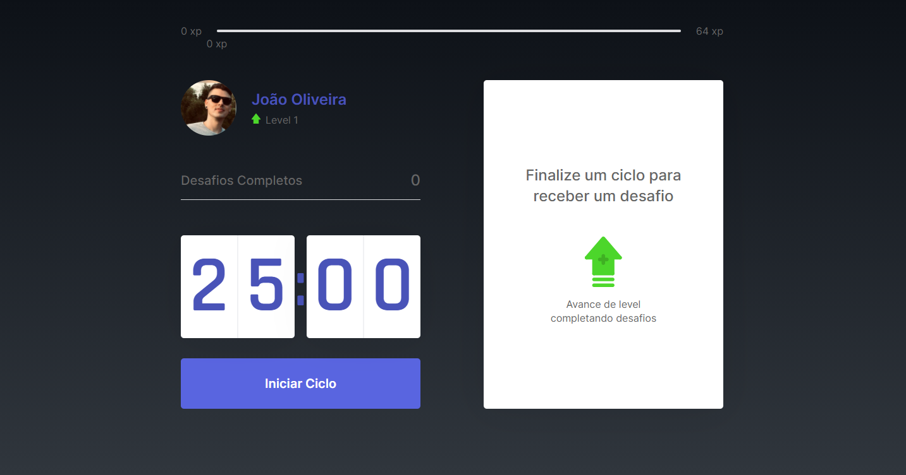
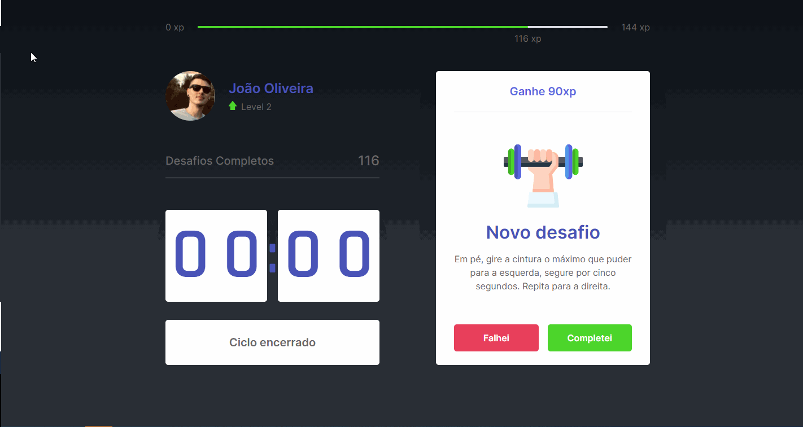

# Projeto moveit

Projeto criado na semana next level week 4 MoveIt, com objetivo de incentivar quem fica horas no computador a se exercitar, usando o método pomodoro, a cada 25 minutos concentrado no trabalho ele terá uma pausa para efetuar um pequeno exercício e com adição da gamificação na aplicação.

Técnologias utilizadas:

 - ReactJS
 - Styled-Components
 - NextJS 
 - ContextAPI 
 - Typescript

Link para acesso: https://next-level-week-4-joaooliveiraa.vercel.app/

